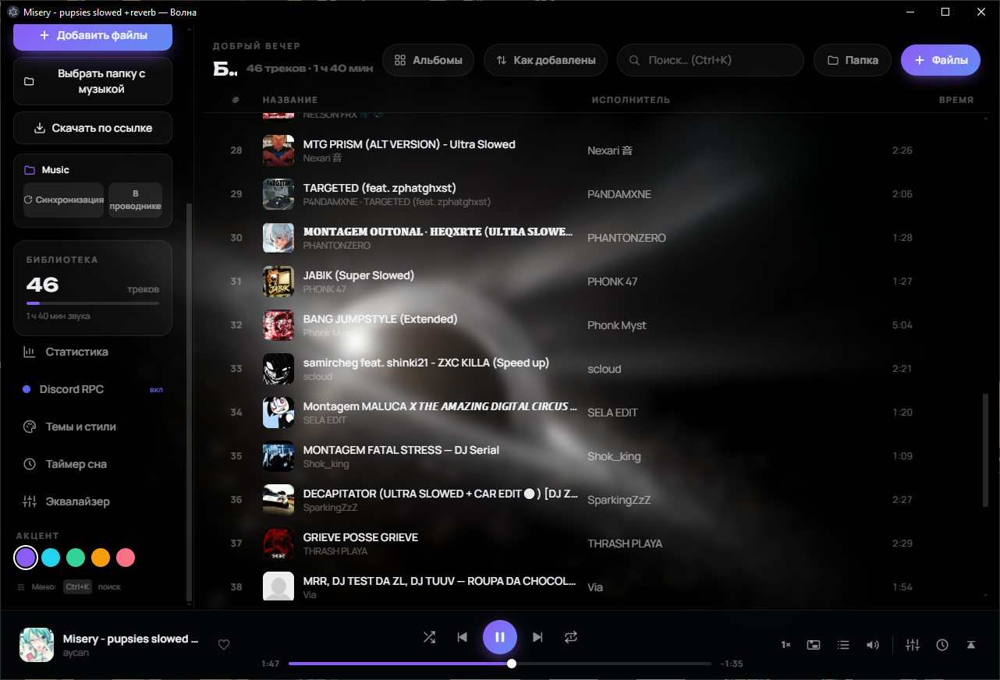

<div align="center">

# 🌊 Волна

### Лёгкий музыкальный плеер для Windows

**Минимальная нагрузка на ПК · Крутой дизайн · Темы и кастомизация · Discord RPC · Скачивание музыки по ссылке**

</div>

---

## ✨ Возможности

- 🎵 **Воспроизведение локальной музыки** — выбери папку с треками, всё подтянется автоматически (MP3, FLAC, WAV, OGG, M4A, AAC, OPUS, WEBM, WMA)
- 📁 **Синхронизация папки** — новые файлы добавляются сами, удалённые исчезают
- 🎚 **10-полосный эквалайзер** с 9 пресетами + отдельная **громкость каждого трека**
- 🌌 **Визуализация на весь экран** в «Сейчас играет» с зеркальным отражением
- 📃 **Плейлисты, очередь, «играть следующим», избранное, недавние, статистика**
- 🎨 **Темы и стили**: 10 готовых тем, свои обои (включая **анимированные GIF**), редактор CSS-кода + **ИИ-генератор промпта** для ChatGPT
- 🪟 **Мини-плеер** — маленькое окно поверх всех окон
- 🎧 **Discord Rich Presence** — статус «Слушает» как у Spotify
- ⬇️ **Скачивание аудио по ссылке** (YouTube, VK, Twitch, TikTok и ещё 1000+ сайтов через yt-dlp) — с обложкой и тегами
- 💿 Альбомный вид, сортировки, ПКМ-меню трека, горячие клавиши, медиа-клавиши
- ⚡ **Минимум ресурсов**: 1 rAF-цикл только во время музыки, 0 фоновых процессов

---

## 🖼 Скриншоты

**Главное окно** — библиотека с плеером внизу:


**«Сейчас играет»** — винил и визуализация на весь экран:


**Обложка в библиотеке:**



**Темы и обои** — в том числе анимированные GIF:


**Мини-плеер** — маленькое окно поверх всех окон:


---

## 🚀 Установка

### Способ 1 — готовый exe (для друзей)

Скачай **`Волна Setup 1.2.0.exe`** из релизов → запусти → установи → слушай музыку.

### Способ 2 — собрать самому

Нужен [Node.js](https://nodejs.org) (LTS).

```bash
# 1. Собрать сайт
npm install
npm run build

# 2. Собрать Windows-приложение
cd electron
npm install
npm run build
```

Установщик появится в `electron/release/Волна Setup 1.2.0.exe`.

Быстрый запуск без установки: `cd electron && npm start`

---

## ⌨️ Горячие клавиши

| Клавиша | Действие |
|---|---|
| `Пробел` | play / pause |
| `←` `→` | перемотка ±5 сек |
| `↑` `↓` | громкость |
| `M` | mute |
| `N` / `P` | следующий / предыдущий |
| `Ctrl+O` | добавить файлы |
| `Ctrl+K` | поиск |
| Медиа-клавиши | play / next / prev |
| ПКМ по треку | контекстное меню |
| Зажать логотип «Волна» | список open-source проектов |

---

## 🎧 Discord Rich Presence

Статус **«Слушает: Название — Исполнитель»** с обратным отсчётом и иконкой приложения.

Уже настроено: Application ID и ассет `volna-icon` вписаны в `electron/main.js`.
Если хочешь сделать **своё** приложение — [discord.com/developers/applications](https://discord.com/developers/applications) → New Application → скопируй ID и вставь в `electron/main.js`:

```js
const DISCORD_APP_ID = process.env.VOLNA_DISCORD_APP_ID || "твой_id";
const DISCORD_ASSET = process.env.VOLNA_DISCORD_ASSET || "имя_ассета";
```

---

## 🎨 Темы и кастомизация

- **10 готовых тем** — перекрашивают весь интерфейс через CSS-переменные
- **Свои обои** — PNG / JPG / **анимированные GIF**, затемнение и размытие
- **CSS-редактор** — вписал код → UI стал другим. Всё на переменных:

```css
:root { --accent: #ff00aa; --bg-base: #000; }
.track-cover { border-radius: 999px; }
```

- **🤖 ИИ-генератор** — опиши стиль по-русски, получи промпт на английском для ChatGPT/Claude, вставь ответ — тема применится сама

---

## 📦 Скачивание музыки по ссылке

Кнопка **«Скачать по ссылке»** в сайдбаре. Работает через [yt-dlp](https://github.com/yt-dlp/yt-dlp) (1000+ сайтов):

- YouTube, VK Видео, Twitch, TikTok, Vimeo, SoundCloud, Bandcamp и т.д.
- Конвертация в **MP3** через FFmpeg, вшивается обложка и название
- Трек сразу появляется в библиотеке
- При первом запуске сам скачивает yt-dlp и FFmpeg

---

## 🗂 Структура проекта

```
├── src/                  # весь код плеера (React + TypeScript)
│   ├── engine/           # аудио-движок (Web Audio API: эквалайзер, анализатор)
│   ├── components/       # UI: плеер, плейлист, тем, мини-плеер, модалки…
│   ├── hooks/            # библиотека (IndexedDB), статистика, плейлисты
│   ├── lib/              # обложки (iTunes/Deezer), БД, форматирование
│   ├── theme/            # темы и CSS-переменные
│   └── mini/             # мини-плеер (отдельное окно)
├── electron/             # обёртка Windows (.exe)
│   ├── main.js           # main-процесс: папки, теги, RPC, yt-dlp, мини-окно
│   └── package.json      # сборка через electron-builder
└── dist/                 # собранный сайт (создаётся сборкой)
```

---

## 🛠 Используемые open-source проекты

| Проект | Зачем |
|---|---|
| [Electron](https://electronjs.org) | оболочка Windows-приложения |
| [React](https://react.dev) | интерфейс |
| [Vite](https://vitejs.dev) | сборщик |
| [Tailwind CSS](https://tailwindcss.com) | стили |
| [electron-builder](https://www.electron.build) | сборка .exe |
| [music-metadata](https://github.com/Borewit/music-metadata) | теги и обложки MP3/FLAC |
| [yt-dlp](https://github.com/yt-dlp/yt-dlp) | скачивание аудио по ссылке |
| [ffmpeg-static](https://github.com/eugeneware/ffmpeg-static) | конвертация в MP3 |
| [discord-rpc](https://github.com/discordjs/RPC) | статус в Discord |
| [iTunes Search API](https://performance-partners.apple.com/search-api) | обложки альбомов |
| [Deezer API](https://developers.deezer.com) | запасной источник обложек |
| [Manrope / Unbounded](https://fonts.google.com) | шрифты |

---

## 📝 Лицензия

MIT — можно использовать, форкать и дорабатывать.

Сделано с 🌊 и ❤️
